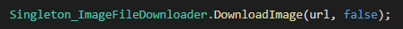

LIAISONS S3

SOMMAIRE

[INTRODUCTION](#_2z45yrnhv5an)

[URL & MDP](#_5qh5wq80t81c)

[UPLOAD SUR LE S3](#_ds90ao6b70d8)

[DOWNLOAD SUR LE S3](#_frjgafcsrq32)

## INTRODUCTION

<https://aws.amazon.com/fr/s3/>

<https://821544427390.signin.aws.amazon.com/console> 

Dossier du projet :

s3://com.tribiew.testwebapp/TribiewV0.4/Series/

Amazon Simple Storage Service (Amazon S3) est un service de stockage d'objets offrant une évolutivité, une disponibilité des données, une sécurité et des performances de pointe. Les clients de toutes tailles et de tous secteurs peuvent ainsi utiliser ce service afin de stocker et protéger n'importe quelle quantité de données pour un large éventail de cas d'utilisation comme des lacs de données, des sites web, des applications mobiles, la sauvegarde et la restauration, l'archivage, des applications d'entreprise, des appareils IoT et des analyses du Big Data. Amazon S3 fournit des fonctions de gestion faciles à utiliser pour vous permettre d'organiser vos données et de configurer des contrôles d'accès affinés pour vos exigences métier, d'organisation et de conformité spécifiques. Amazon S3 est conçu pour offrir 99,999999999 % (11 9) de durabilité et stocker les données de millions d'applications pour des entreprises du monde entier.

<http://whats-in-a-game.com/how-to-connect-to-s3-in-unity/>

<https://docs.aws.amazon.com/fr_fr/mobile/sdkforunity/developerguide/what-is-unity-plugin.html> 

<https://aws.amazon.com/fr/s3/getting-started/>

## URL & MDP

Tribiew URL

[https://s3-us-west-1.amazonaws.com/com.tribiew.testwebapp/TribiewV0.4/](https://s3-us-west-1.amazonaws.com/com.tribiew.testwebapp/TribiewV0.4/ProfilePic1.png/)

<http://163.172.93.149:3010/graphql/>

## UPLOAD D’IMAGES SUR LE S3
Pour upload une image sur le S3 il suffit d’appeler la fonction “UploadImage” du script “Singleton\_ImageUploader” et de lui passer la Texture2D en question ainsi que l’Url ou l’on désire l’uploader et enfin le nom de l’image

UPLOAD D’IMAGES DE NEWS SUR LE S3 AVEC LA SCENE “UploadImage”

Pour upload une image de news d’une série sur le S3, il suffit de spécifier le path local de l’image et d’appuyer sur “choose Image” pour qu’elle s’affiche, puis de spécifier le nom de l’image, et le nom de la série (attention aux fautes) puis de cliquer sur upload.

## DOWNLOAD SUR LE S3
Pour pouvoir télécharger un fichier depuis le S3, il faut correctement Setup ses autorisations lors de l’upload (que ce soit un Upload via script ou via l’interface AWS).

Les autorisations doivent être setup comme l’image ci-dessous, c’est-à-dire en Lecture publique.

par la suite, en script il suffira de récupérer l’URL de l’objet et de la faire passer dans une fonction de Download comme ci-dessous:

*exemple pour le téléchargement d’une image*

Des exemples peuvent être trouvées dans les scripts “BehaviourPopUpLoading” et “JsonManager”.
