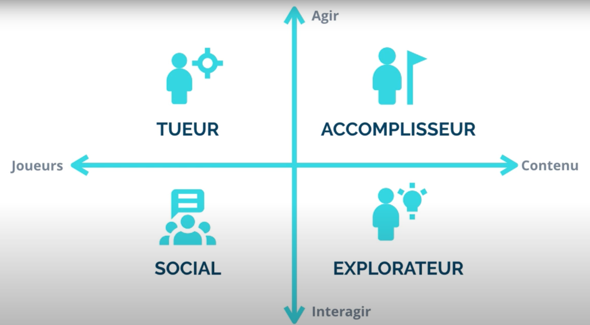

#
# **TUTO GAMIFICATION**

il faut dans un premier temps identifier les points suivants : Objectifs business et Besoins utilisateurs.

[https://drive.google.com/file/d/1D\_ChObezkjmZQWxi24JlQ6IrYxD4yQHK/view?usp=sharing](https://drive.google.com/file/d/1D_ChObezkjmZQWxi24JlQ6IrYxD4yQHK/view?usp=sharing)

Objectifs business

Ce sont les objectifs généraux du business. Fidélisation (faire revenir les utilisateurs 1 fois par semaine, 1 fois par jour, plusieurs fois par jour…), engagement (utiliser une fonctionnalité spécifique, le maximum de fonctionnalité…), monétisation (faire un achat in-app, souscrire à un abonnement).

Besoins utilisateurs

Ce sont les besoins que vos utilisateurs cherchent à combler en utilisant votre application. Par exemple : un commercial attend de son CRM qu&#39;il l&#39;aide à mieux vendre. Un utilisateur d&#39;une application de running peut attendre un coaching pour ses performances ou simplement pour une remise en forme.

Comportements

Ensuite, on peut déduire les comportements associés aux Objectifs business et aux Besoins utilisateurs.

La question est la suivante :

- Quels comportements utilisateurs sont nécessaires pour accomplir mes Objectifs business ?
- Quels comportements utilisateurs sont nécessaires pour accomplir les Besoins utilisateurs ?

Alignement

Comme vous pouvez l&#39;imaginer, il n&#39;est pas garanti que les comportements permettant d&#39;accomplir les Objectifs Business seront les mêmes que ceux permettant d&#39;accomplir les Besoins des utilisateurs. Dans la démarche méthodologique, il est donc impératif de prioriser les Objectifs et Besoins pour identifier les « bons » comportements. Les comportements à inciter en priorité sont donc associés à la fois à des Objectifs et Besoins prioritaires.

##

## LEÇON 1 : Le Flow

[https://www.youtube.com/watch?v=WG8AMynMt5c](https://www.youtube.com/watch?v=WG8AMynMt5c)

## LEÇON 2 : La théorie de MCGONIGAL

[https://www.youtube.com/watch?v=8DYwPzFaYAI](https://www.youtube.com/watch?v=8DYwPzFaYAI)

## LEÇON 3 : LE CTA ou TRIGGERS du modèle de FOGG

Pour mener une analyse des comportements, il existe de **nombreuses méthodes**. voici le modèle de Fogg.

[https://www.youtube.com/watch?v=QWjnhUZGZlc&amp;t=78s](https://www.youtube.com/watch?v=QWjnhUZGZlc&amp;t=78s)

Les facteurs de motivations (résumé non exhausitf) qui permet qu&#39;un Trigger soit activé par un joueur:

- Plaisir/Douleur
- Espoir/Peur
- Acceptation social/rejet social

Définir toujours si votre CTA est soit :

- CTA motivateurs (faisant appel à la motivation)
- CTA facilitateurs (faisant appel à la capacité)

Pour aller plus loin :

Behaviour Model de Fogg :

**Le modèle de Fogg**

Fogg est le fondateur du Persuasive Technology Lab à l&#39;Université de Stanford. Il a créé un modèle détaillant les deux conditions nécessaires à la réalisation d&#39;un comportement dans une application : la motivation et la simplicité.

Le modèle est résumé dans le graphe suivant :

Si l&#39;action est très difficile alors il faut beaucoup de motivation. Si l&#39;utilisateur est peu motivé alors l&#39;action doit être très facile. En résumé, pour que l&#39;utilisateur accomplisse l&#39;action demandée il doit disposer d&#39;un &quot;panier&quot; de compétences et de motivation. La motivation et la simplicité sont corrélées à de nombreux critères mais ce n&#39;est pas le sujet aujourd&#39;hui.

**Psychologie et économie comportementale**

Jusque là, le modèle est plutôt intuitif. Pourtant, les choses sérieuses commencent lorsqu&#39;on veut déterminer plus précisément les motivations et les freins à l&#39;action. Et là, il faut prendre du recul et sortir du modèle de Fogg pour plonger au cœur de la psychologie et de l&#39;économie comportementale.

Il existe littéralement des centaines de biais influençant nos comportements. En voici quelques-uns parmi les plus emblématiques :

- La preuve sociale : tendance à agir comme on pense que les autres agiraient dans une situation similaire. La preuve sociale est particulièrement efficace dans un contexte d&#39;incertitude.
- Le biais de cohérence : tendance à agir en cohérence avec ses habitudes passées.
- Le biais de rareté : tendance à surévaluer un bien présenté comme rare, même si nous n&#39;en avons pas besoin.

Un exemple d&#39;utilisation du biais de preuve sociale dans la vente de produits en ligne : les **témoignages** (« _ **testimonials** _ »). Ils permettent au visiteur de voir que d&#39;autres personnes ont aussi acheté le produit et ont été satisfaites.

Dans la troisième partie de la méthode, nous verrons que pour chaque frein ou motivation, il existe de nombreuses techniques permettant d&#39;engager l&#39;utilisateur. Ainsi, l&#39;analyse comportementale consiste à filtrer chaque comportement à travers différents modèles pour en déduire les techniques adéquates.

## LEÇON 4 : La typologie des joueurs de Bartle et les personnas

[https://www.youtube.com/watch?v=U\_q2jckxt6s&amp;t=11s](https://www.youtube.com/watch?v=U_q2jckxt6s&amp;t=11s)

## 

Il existe des mécaniques pour motiver les comportements. 4 grands types de mécaniques que l&#39;on peut répertorier dans le graphe suivant :

Comme vous pouvez le voir sur l&#39;image ci-dessus, le graphe est structuré autour de deux axes : Performance | Sens et Communauté | Contenu. Les mécaniques et fonctionnalités de votre expérience se distinguent suivant qu&#39;elles sont orientées vers l&#39;un de ces 4 « points cardinaux ».

Performance : les systèmes qui poussent les utilisateurs à se dépasser utilisent des mécaniques de performance.

Sens : les systèmes utilisent les mécaniques de sens pour créer l&#39;attachement émotionnel des utilisateurs et donner du sens à leurs actions.

Communauté : les mécaniques permettant une interaction entre les utilisateurs pour stimuler la communauté.

Contenu : les mécaniques permettant d&#39;interagir avec le contenu proposé par le système.

Il en découle 4 grands types d&#39;expériences :

- Coaching : accompagner, coacher l&#39;utilisateur vers la réussite de son objectif. Exemple de mécanique : une barre de progression.
- Storytelling : motiver les utilisateurs à travers un approfondissement du sens donné à l&#39;expérience. Exemple de mécanique : ajouter sa photo de profil sur un service en ligne.
- Coopération : motiver les utilisateurs à travers la création d&#39;un objectif commun. Exemple de mécanique : un Like sur Facebook.
- Compétition : motiver les utilisateurs à travers la comparaison avec d&#39;autres utilisateurs. Exemple de mécanique : une offre exclusive.

De quelles mécaniques avez-vous besoin ?

- Vous avez toujours besoin de créer un système de coaching. La plupart du temps, on les retrouve sur le profil utilisateur. Celui-ci est la pierre angulaire de tout système d&#39;engagement design. On peut motiver des comportements de manière très efficace juste en concevant un profil utilisateur.
- Si vous avez besoin de créer des interactions entre utilisateurs alors vous devrez en plus ajouter des mécaniques de « communauté » et plus particulièrement des mécaniques de coopération.
- Si vous avez besoin d&#39;inciter de manière implicite les actions des utilisateurs mais sans viser une véritable interaction communautaire alors vous pourrez utiliser des mécaniques de « communauté » et plus particulièrement des mécaniques de compétition.
- Enfin le storytelling est particulièrement important pour la motivation des utilisateurs (faible motivation détectée lors de l&#39;analyse comportementale).

##

##

## LEÇON 5 : La théorie du Fun de Raph Coster

[https://www.youtube.com/watch?v=4oJrNVbKVa0](https://www.youtube.com/watch?v=4oJrNVbKVa0)

- Les feedback doivent être variable
- Parcours vers la maitrise (apprentissage)
- Le coût de l&#39;échec

Pour aller plus loin :
 Le blog de Raph Koster : [https://www.raphkoster.com/games/](https://www.raphkoster.com/games/)

## LEÇON 6 : Le modèle Hooked de Nir Eyal

[https://www.youtube.com/watch?v=R\_GnIVnZDNw](https://www.youtube.com/watch?v=R_GnIVnZDNw)

La boucle de Eyal

Les récompenses :

- Rewards of the Tribe
- Rewards of the Hunt
- Rewards of the Self

Investment :

- Personnalisation de l&#39;expérience ⇒ Amener un nouveau CTA selon personnalisation

**{Définition} Récompense aléatoire**

Pour satisfaire vos joueurs, vous devez leur donner une récompense. Elle n&#39;est pas forcément un cadeau, elle peut être une simple récompense virtuelle, sans valeur réelle. Le plus important avec les récompenses, c&#39;est la manière dont on les distribue. On peut distribuer les récompenses pour un nombre d&#39;actions déterminé : par exemple &quot;se connecter sur une application&quot;. Mais on peut aussi distribuer les récompenses avec une fréquence aléatoire : parfois à chaque connexion, parfois au bout de trois ou dix connexions. La récompense aléatoire, c&#39;est le fait de ne pas savoir avec certitude si l&#39;action réalisée donnera accès à une récompense.

**{Avantage} Créer l&#39;addiction**

La récompense aléatoire est le meilleur moyen de créer l&#39;addiction. Ainsi, si vous identifiez un comportement clé dans l&#39;expérience de vos utilisateurs, vous pouvez récompenser ce comportement de manière aléatoire. Les utilisateurs reproduiront ce comportement plus souvent.

Voici le fonctionnement de ce phénomène d&#39;addiction. En présence de récompenses aléatoires, le cerveau sécrète de la dopamine.

C&#39;est cette dopamine qui crée l&#39;addiction. Pour faire simple, la dopamine n&#39;est pas la molécule du plaisir de la récompense, elle est la molécule de la recherche de la récompense : plus le cerveau est &quot;sous dopamine&quot; plus le joueur cherche à réaliser l&#39;action qui déclenche la récompense. Dans le cas d&#39;une récompense classique, le cerveau sécrète également de la dopamine mais en quantité bien moindre.

**{dans les jeux} Machines à sous**

La récompense aléatoire est la technique qui crée l&#39;addiction aux machines à sous et de manière générale de tous les jeux de hasard. En fait, comme son nom le laisse deviner, jeu de hasard signifie avant tout &quot;jeu à récompenses aléatoires&quot;, donc jeu à potentiel addictif. En gamification, il ne faudra pas faire du &quot;pur hasard&quot;. Les jeux seront d&#39;autant plus efficaces qu&#39;ils laisseront aux joueurs une voie vers la compréhension puis la maîtrise du système : le joueur expert devrait avoir des probabilités beaucoup plus importantes de gagner tandis qu&#39;un débutant devrait pouvoir garder l&#39;espoir de bénéficier de la &quot;chance du débutant&quot;.

**{In Real Life} Le scroll infini de Facebook**

Un exemple de récompense aléatoire de la vie quotidienne est Facebook. Le réseau social utilise la technique de la récompense aléatoire pour retenir plus longtemps les utilisateurs lorsqu&#39;ils se connectent au service. Cette technique, c&#39;est le scroll infini. Le scroll infini est le fait de pouvoir descendre indéfiniment le fil d&#39;actualité. La plupart du temps quand on regarde son fil d&#39;actualité, on tombe sur des contenus inintéressants, on continue donc de faire défiler le fil vers le bas jusqu&#39;à trouver un contenu « intéressant ». À ce moment là, on s&#39;arrête, on regarde le contenu (des photos ou une vidéo le plus souvent). Puis lorsqu&#39;on finit de regarder le contenu, on revient sur le fil d&#39;actualité, et on continue de descendre. Parmi tous les contenus inintéressants, le contenu intéressant est une récompense. Mais cette récompense est aléatoire car il est impossible de savoir quand le prochain contenu intéressant arrivera dans le fil d&#39;actualité. Normalement, si vous observez bien votre propre comportement, vous devriez constater que vous réagissez de cette façon. Dès que vous découvrez un contenu intéressant vous continuez de &quot;scroller&quot; parce qu&#39;il existe des probabilités pour qu&#39;un contenu intéressant apparaisse : ce comportement est entièrement conditionné par la récompense aléatoire.

## MISE EN PRATIQUE TRIBIEW :

C&#39;est le moment de construire très précisément l&#39;expérience de l&#39;utilisateur dans l&#39;application. Cela se fait à travers un travail dans deux domaines : **l&#39;UI (interface) et la Scénarisation**.

On va commencer par la Scénarisation, partie immergée de l&#39;iceberg. Contrairement à l&#39;UI, on ne l&#39;a voit pas, et pourtant elle est la clé de voûte de la fidélisation et de l&#39;engagement.

**Scénarisation**

Scénariser, c&#39;est prévoir tous les feedbacks que l&#39;application va envoyer à l&#39;utilisateur en fonction de son activité. La scénarisation concerne plusieurs aspects de l&#39;expérience dont les notifications, les récompenses, la pointification…

- Notifications (push ou in-app) : elles font partie du système CRM au même titre que les emails. L&#39;enjeu est de « relancer » l&#39;utilisateur au bon moment, avec le bon message pour augmenter les chances de passage à l&#39;action.

- Récompenses : il existe d&#39;innombrables récompenses. Réelle / virtuelle, certaine / aléatoire… toutes ne sont pas efficaces dans le même contexte. Par exemple les récompenses aléatoires sont extrêmement efficaces pour créer une utilisation répétée, voire une addiction, mais elles s&#39;utilisent dans une situation adéquate sous peine d&#39;être totalement contre-productives. Lisez attentivement l&#39;email bonus de ce cours qui sera consacré à cette récompense emblématique !

- Pointification (scoring) : finalement, on pourrait définir la scénarisation comme une série de feedbacks qui se déclencheraient lorsque certaines conditions seraient remplies par l&#39;utilisateur. Chaque action de l&#39;utilisateur doit être « pointifiée » (on lui attribue un score) pour envoyer le bon feedback.

**UI (Interface)**

Intéressons-nous maintenant à l&#39;UI, partie visible de l&#39;iceberg. Construire l&#39;UI consiste à choisir les bons écrans et le bon enchaînement d&#39;écrans au sein de votre application. Exemples.

- Profil utilisateur

On doit retrouver l&#39;écran de Profil dans toutes les applications dont le but est d&#39;engager les utilisateurs. Voici ci-dessous une illustration d&#39;un Profil utilisateur de l&#39;application Headspace. Il inclut un ensemble de statistiques permettant à l&#39;utilisateur de jauger sa progression. Il s&#39;agit d&#39;une technique de Quantified-self (type de mécaniques de Coaching).

- Wording

Autre élément fondamental de l&#39;UI, le wording utilisé sur chaque écran. Cette pratique a un nom : l&#39;UX writing.